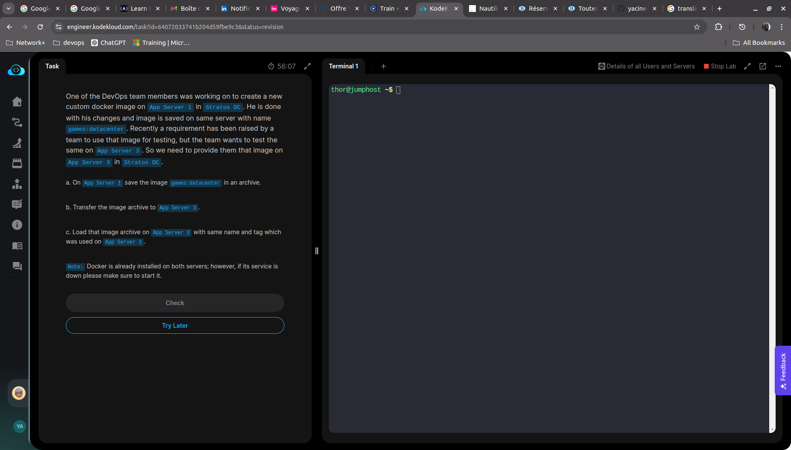

# KKE-Save-Load-TransferDockerImage

L'un des membres de l'équipe DevOps travaillait sur la création d'une nouvelle image Docker personnalisée sur App Server 1 dans Stratos DC. Il a terminé ses modifications et l'image est enregistrée sur le même serveur avec le nom games:datacenter. Récemment, une équipe a demandé à utiliser cette image à des fins de test, mais l'équipe souhaite tester la même chose sur App Server 3. Nous devons donc leur fournir cette image sur App Server 3 dans Stratos DC.

un. Sur App Server 1, enregistrez l'image games:datacenter dans une archive.

b. Transférez l'archive d'images vers App Server 3.

c. Chargez cette archive d'images sur App Server 3 avec le même nom et la même balise que ceux utilisés sur App Server 1.

Remarque : Docker est déjà installé sur les deux serveurs ; cependant, si son service est en panne, assurez-vous de le démarrer.

